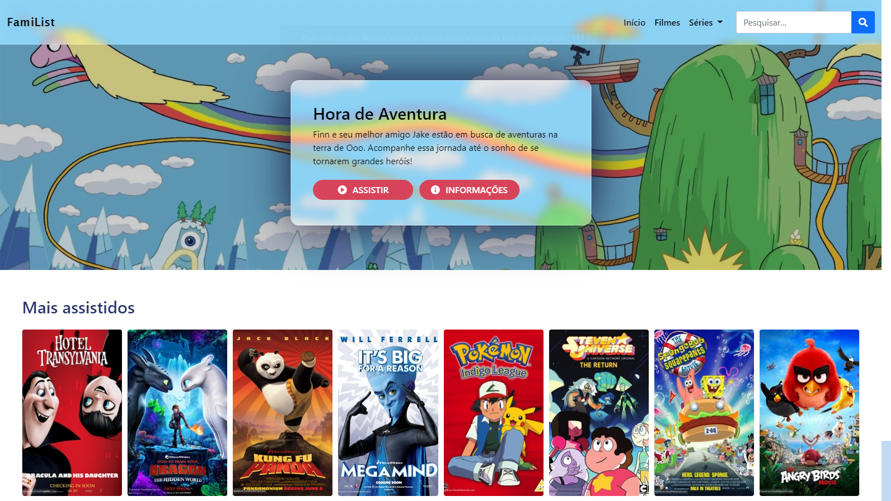

# netflix-clone 📺
Projeto para o curso "Recriando a Interface do Netflix" que é parte do bootcamp Take Blip da Digital Innovation One.

 - [Exemplo online](https://srtazuzza.github.io/netflix-clone/)
 - [Projeto original](https://github.com/felipeAguiarCode/netflix-clone)

